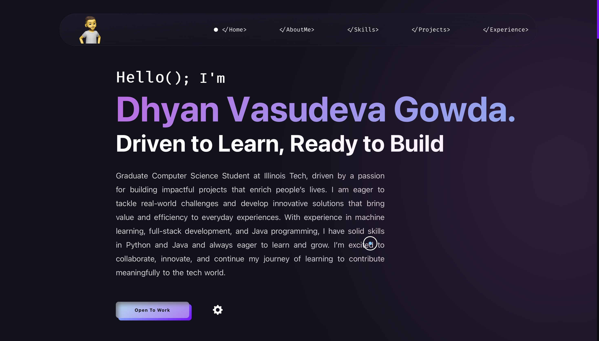

# <a href="https://dhyanvgowda.github.io/" target="_blank">My Portfolio</a>

This website showcases my projects, online presence, story, work experience, and contact information.

[]

:star: Star me on GitHub — it helps!

# Sections 📚

✔️ Mini intro\
✔️ About me \
✔️ Skills\
✔️ Projects\
✔️ Experience\
✔️ Contact me

## License 📄

This project is licensed under the MIT License - see the [LICENSE.md](./LICENSE) file for details.

Please contact me at dhyansanvi@gmail.com if you have any feedback for the website. :star: Star it, if you like it!
